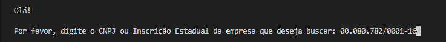
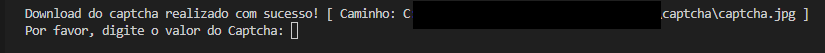

# Spider Sintegra

Em um breve resumo, um spider é um sistema para captura de informações em sites da internet.

O spider sintegra tem o propósito de capturar informações sobre inscrições estaduais cadastrados no estado do Paraná.

Para rodar esse projeto em sua máquina, basta clonar este repositório da seguinte forma: 

~~~bash
    git clone https://github.com/Philipelima/spider-sintegra.git
~~~

Antes de rodar esse script, certifique-se que algumas extenções do php estejam habilitadas:

 * <b>curl</b>
 * <b>iconv</b>
 * <b>mbstring</b>

Você pode verificar isso usando o seguinte comando no php CLI:

~~~bash
    php -m
~~~

Caso elas não apareçam na listagem, basta habilita-las no arquivo <b>php.ini</b>.

### Utilização do Spider

1. No diretório do projeto, digite o seguinte comando: 

~~~bash
    php ./SpiderTest.php
~~~

 

<legend>Se toda configuração estiver okay, seguinte mensagem irá aparecer para você:</legend>

 

2. Informe um cnpj que você deseja buscar (ele precisa estar cadastrado no sintegra do Paraná):

 

O spider irá realizar o download do captcha solicitado pelo sintegra, e lhe mostrar logo em seguida

 

3. Abra a imagem que se encontra no caminho mostrado a cima e digite o texto apresentado na imagem:

    

Se o captcha for digitado errado, a seguinte mensagem de erro aparecerá para você:

    

